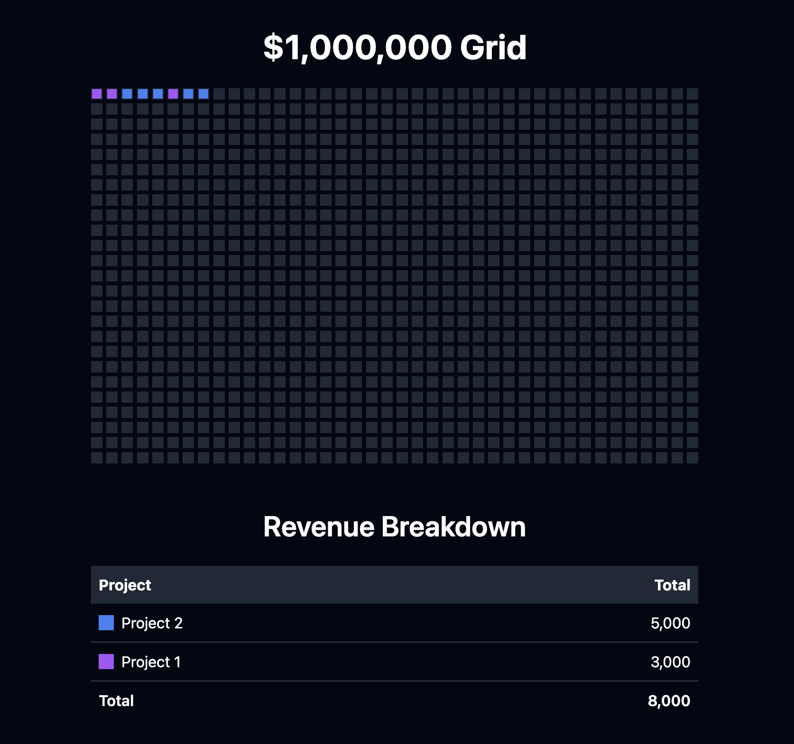

# Million Dollar Grid

This project displays a visual representation of revenue data using a grid of colored squares, where each square represents $1,000. It also provides a breakdown of revenue by project.

See example live at [https://florin-pop.com/one-million/](https://florin-pop.com/one-million/)

## Getting Started

### Prerequisites

-   A web server to serve the HTML, JavaScript, and JSON files
-   Modern web browser with JavaScript enabled

### Installation

1. Clone this repository or download the files to your local machine.

2. Ensure you have the following files in your project directory:

    - `index.html`
    - `index.js`
    - `_data.json`

3. No additional installation is required as the project uses CDN-hosted Tailwind CSS.

### Configuration

Edit the `_data.json` file to customize the grid:

-   `categories`: Define the categories and their associated colors and links.
-   `revenue`: List of revenue entries with value (income), category from `categories`, and date.
